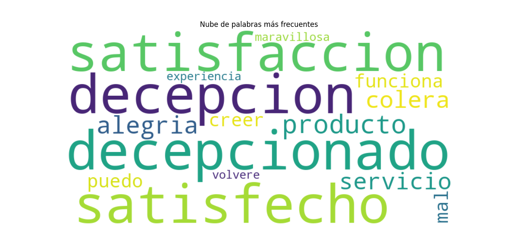
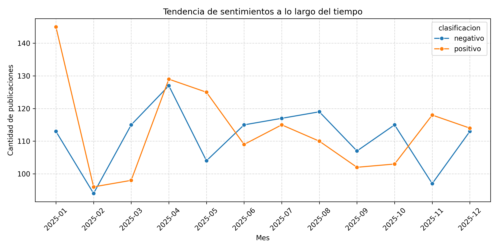
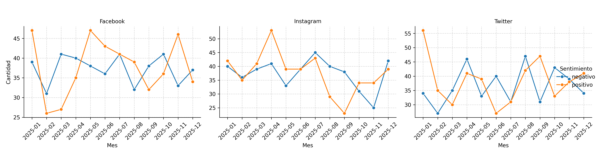
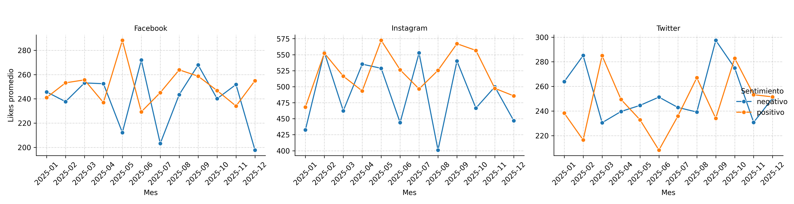
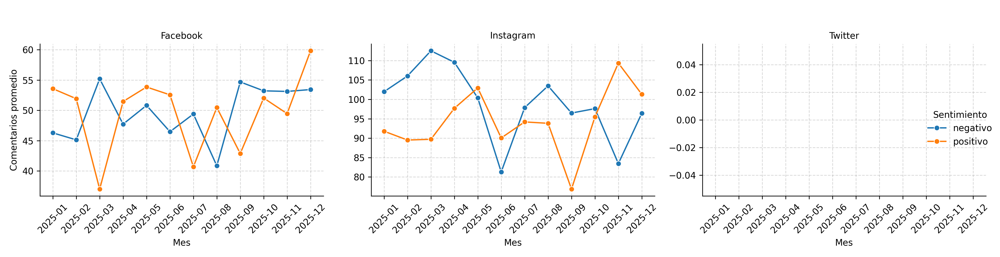
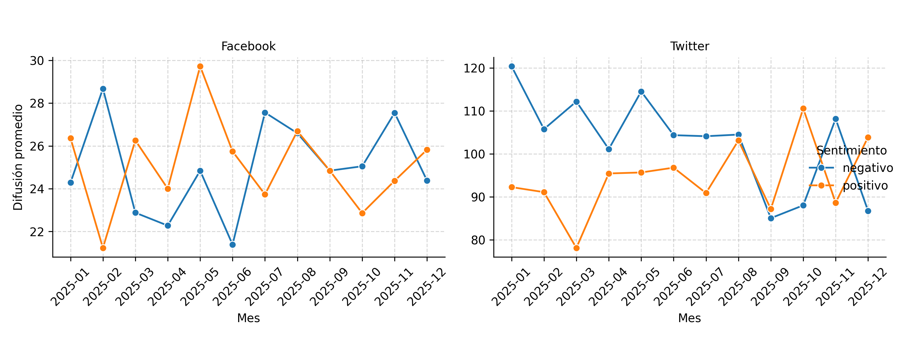

# 📊 Análisis de Tendencias en Redes Sociales

By: Rosario Quispe, Carlos Ramirez and Juan Saavedra

Este proyecto tiene como objetivo preprocesar, analizar y visualizar datos de redes sociales (Facebook, Instagram y Twitter) con el fin de identificar **tendencias de interacción y sentimientos a lo largo del tiempo**. Se trabaja con datos de publicaciones y se utilizan técnicas de procesamiento de lenguaje natural (NLP), análisis de sentimientos y visualización de datos.

---

## 🔧 Requisitos

- Python 3.9+
- pip
- Entorno virtual 

Instalación de dependencias:

```bash
pip install -r requirements.txt
```

---

## 📁 Estructura del proyecto

```
tendencias_redes/
│
├── Data/                  # Archivos .json con datos de Facebook, Instagram y Twitter
├── Notebooks/             # Desarrollo principal en Jupyter Notebook
│   └── analisis_redes.ipynb
├── Scripts/               # Funciones reutilizables (preprocesamiento de texto)
│   └── procesamiento_texto.py
├── Outputs/               # Gráficos y visualizaciones generadas
├── requirements.txt       # Librerías necesarias
└── README.md              # Descripción del proyecto
```

---

## 📥 Cómo clonar y ejecutar

```bash
git clone https://github.com/rosquiya/proyecto-tendencias-redes.git
cd proyecto-tendencias-redes
python -m venv venv
source venv/bin/activate  # En Windows: .\venv\Scripts\activate
pip install -r requirements.txt
jupyter notebook Notebooks/analisis_redes.ipynb
```

---

## 🔎 Descripción del análisis

1. **Recolección de datos**: lectura de archivos `.json` desde Facebook, Instagram y Twitter.
2. **Preprocesamiento de textos**: limpieza, tokenización, lematización y eliminación de stopwords.
3. **Análisis exploratorio**: visualización de palabras frecuentes, hashtags y n-gramas.
4. **Análisis de sentimientos**: clasificación automática de publicaciones en `positivo`, `neutral` o `negativo` usando un modelo BERT multilingüe.
5. **Detección de tendencias**:
   - Evolución mensual del sentimiento por red social.
   - Interacciones promedio (likes, comentarios, difusión) por sentimiento y por mes.

---

## 📈 Resultado: 
### Palabras más frecuentes
A continuación, se muestra las palabras más frecuentes 


### Tendencia de sentimientos por mes

A continuación, se muestra la tendencia mensual de publicaciones según el tipo de sentimiento:



- Se observa una caida de  publicaciones positivas al inicio del año y por el resto del año la tendencia de caida también se observó
- Las publicaciones negativas son más frecuentes a mitad de año.



- Se observa que las 3 redes tuvieron una tendencia en la caida de sentimiento positivos 

También se analizaron los **likes promedio**, **comentarios promedio** y **retweets/compartidos** según sentimiento y red social.



Si bien es cierto que hubo caida de publicaciones positivas, como se puede observar el promedio de likes apoyando a los negaativos son mucho menor que a los positivos excepto en Twitter




Los comentarios promedios en sentimientos negativos es relativamente mayor que los positivos, excepto Twitter porque no tenemos datos de comentarios. 



El sentimiento negativo tiene mayor cantidad de promedio de retweets en Twitter; en cambio en Facebook hasta mitad de año los sentimientos positivos tenian más compartidos que los negativos en contraste de fin de año. 

---

## 🧠 Modelo usado para análisis de sentimientos

- [`nlptown/bert-base-multilingual-uncased-sentiment`](https://huggingface.co/nlptown/bert-base-multilingual-uncased-sentiment)
- Entrenado para múltiples idiomas, incluyendo español.
- Devuelve una puntuación de 1 a 5 estrellas por publicación.

---

## 📌 Créditos

Este proyecto fue desarrollado como parte del curso de análisis de datos del BSG Institute.
